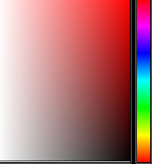

# Linux color inversion

This repository shows how to do "smart" color inversion on Linux.

 

The general idea is to transform black-on-white texts to white-on-black, which may reduce the stress on your eyes, especially in dark environments.

If you know the subject and just want to get the "best" inversion, skip to the "compton" section. If you want to see other alternatives, read next:

## RGB negation
Worst transformation, but also the simplest.

 => 

Black becomes white and vice versa. Color `(r,g,b)` transforms to `(255-r, 255-g, 255-b)`. It can be applied to your system by installing `xcalib`, and running `xcalib -i -a`. To restore the colors type the same command again. This is how the code above will look like in this approach:

## Color matrix multiplication
This is a relatively good approach, although it does lose some quality (see below).

 => 

The idea is to make each (r,g,b) component to be a linear function from original r,g,b values. The picture below was produced by the following formula: `(new_red = 1 - 0.5*green - 0.5*blue)`

You can choose other linear functions, too. For example, this one: `(new_red = 1 + red/3 - 2*green/3 - 2*blue/3)`

 => 

See below on how to use this color transformation on Linux (compton).

References: these color transformations are also implemented in the Windows-only application ["NegativeScreen"](https://github.com/mlaily/NegativeScreen). I studied those repo matrices while doing this comparison.

## RGB negation combined with HUE rotation

This is the "best" approach I found so far (subjective). It does not lose color richness (it's a bijection from full RGB color space to itself), it retails the exact HUE value for each color transformed.

 => 

See below on how to use this color transformation on Linux (compton).

## Making it work with "compton"

In order to bring these niceties to your system do:

* Install `compton` compositor
* Clone this repo (or download the *.glsl files)
* Go into the directory containing the *.glsl files
* Launch the compositor with: `compton --glx-fshader-win "$(cat color_smart.glsl)" --invert-color-include id!=0`

If you want to try out other transformations (like matrices, or maybe some of your own glsl), just insert a different file into the "script" above.

**Warning:** This will replace your current (xfce/gnome/kde/i3/whatever) compositor. Non-permanently, so if you're not satisfied, kill the compositor and/or start your old one back. Alternatively, log out and log in back.

## Alternatives

To the best of my knowledge, these approaches do NOT work:

* XRenderer
* gamma ramps modifications (because they are color-independent)
* xcalib modifications, because it uses gamma ramps
* and actually everything non-OpenGL-based.

Reported to be working:

* ubuntu `compiz` compositor along with a manually compiled "Color Filter" plugin. [https://ubuntuforums.org/showthread.php?t=1419702](https://ubuntuforums.org/showthread.php?t=1419702)